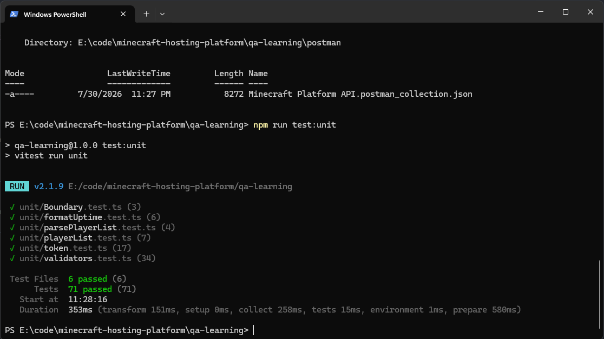
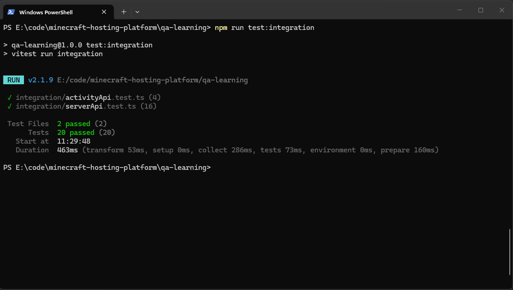
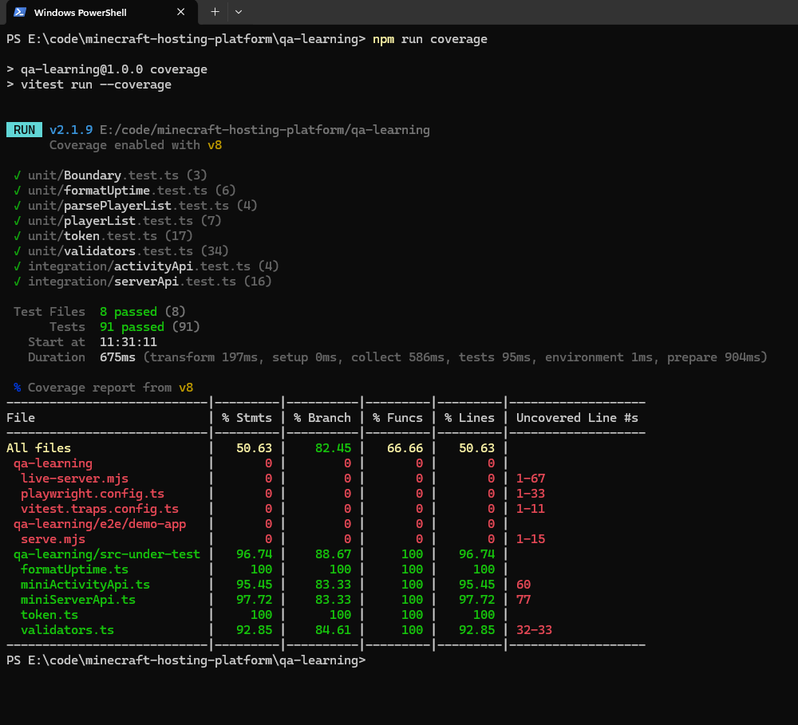
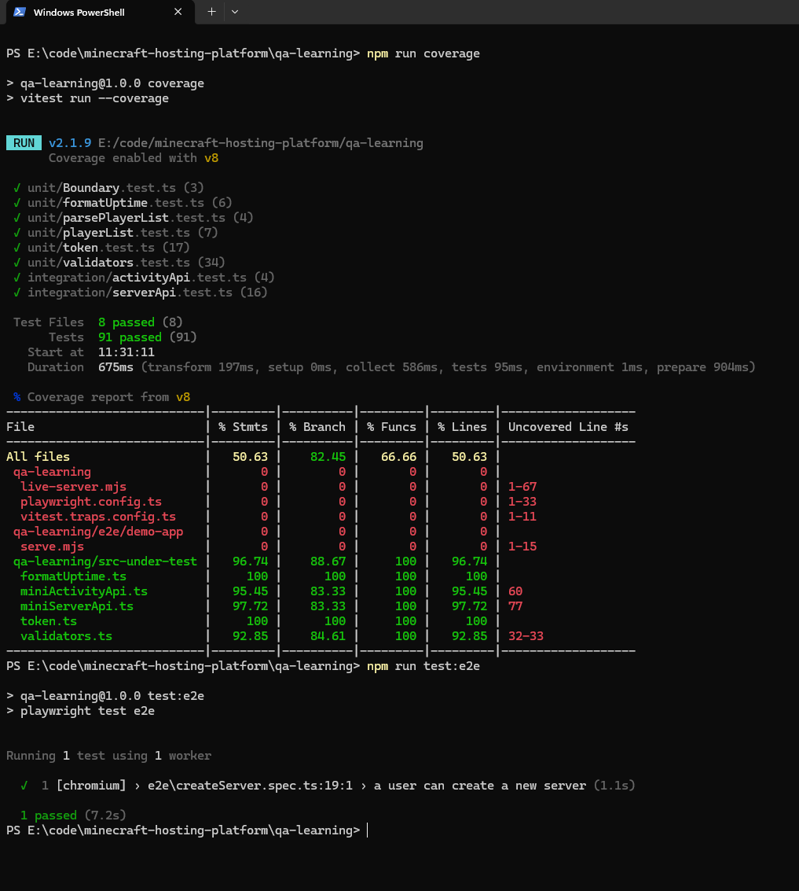
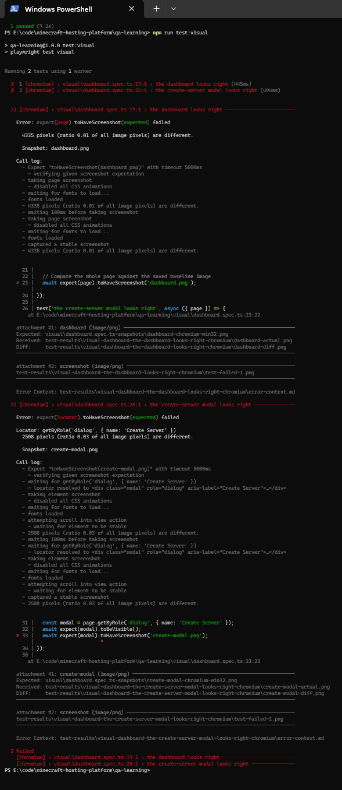

  
  # 🏆 Chelsi Patel — QA Portfolio

> **Automated tests written against a real cloud-native Kubernetes platform.**

📍 Luton, UK · ✉️ [Chelsipatel2001@gmail.com](mailto:Chelsipatel2001@gmail.com) ·
💼 [LinkedIn](https://linkedin.com/in/chelsi-patel-7404231a4) ·
💻 [GitHub](https://github.com/Chelsipatel)

---
## Continuous integration

  Every push runs the suite automatically via GitHub      
  Actions — dependencies
  installed on a clean machine, then unit and integration 
  tests.

  **79 of the 90 tests run in CI (59 unit, 20 integration). Two unit suites
(parsePlayerList, playerList) test application    
 source belonging to the platform owner, which I don't have    
 permission to publish, so they run locally only. This only 
 became visible when the pipeline first ran on a machine that wasn't mine.

## At a glance

| | |
| --- | --- |
| **Automated tests written** | **70+** (in a 91-test suite) |
| **Layers of the testing pyramid covered** | **4** — unit · integration · visual · end-to-end |
| **Coverage achieved** | **96.7%** on the code under test |
| **Defects found & reported** | **6**, with reproduction steps, evidence and severity |
| **Tools** | Vitest · Supertest · Playwright · Postman & Newman · Git · Chrome DevTools |

---

## 🎯 The project

The **Minecraft Hosting Platform** is a real, cloud-native application that deploys and
manages Minecraft servers on **Kubernetes** — a React frontend, a Node.js/TypeScript API with
60+ endpoints, a Go operator, and a CockroachDB database.

I tested it at **every layer of the testing pyramid** — from tiny units of *real production
code* up to full browser journeys — and found and reported six real bugs along the way. Each
case study below tells the story: my thinking, the tests, the evidence, and what I learned.

---

## 👋 About me

I'm a **Computer Science graduate** (BSc Hons, 2:1, University of Bedfordshire, 2024) moving
into QA.

In my final year I was Project Manager on INTERN — a two-sided internship marketplace prototyped in Oracle APEX by a team of five.
I ran the Agile ceremonies and owned the Gantt schedule, work packages, and the risk and quality plans.I ran the Agile ceremonies,
defined the team roles (including our **QA Lead**), and delivered a live product demo to a
panel from **Fiserv**, who said they would invest in it. Running those sprints taught me how
software actually gets built and shipped — and how much easier something is to test when you
genuinely understand *why* it exists and who it's for.

Alongside my studies I spent two and a half years as a Store Support Specialist for
Allenday, across M&S, Tesco, Sainsbury's, Waitrose, Asda and The Range. I trained and
supervised store teams, ran seasonal visual merchandising campaigns across multiple sites,
and was consistently requested back by name by client stores.

I didn't call it QA at the time, but a lot of it was: **a planogram is a specification.** My
job was to compare what was actually built against what the plan said, spot the one thing
that was wrong when everything else looked fine, and flag it clearly enough that someone
could act on it. That's what pulled me toward testing — **I like finding the thing everyone
else walked past.**

Now I do it deliberately, with tools.

---

## 🔺 The testing pyramid — my tests on every layer

```
        /\        End-to-End   → the create-server journey (Playwright)      ← few, slow, most realistic
       /  \       Visual       → dashboard + modal snapshots (Playwright)
      /----\      Integration  → the server CRUD API (Supertest + mocks)
     /------\     Unit         → validators + REAL parsePlayerList (Vitest)  ← many, fast, cheap
    /--------\
```

Lots of cheap unit tests at the base; a few precious end-to-end tests at the top. Each
automated layer mirrors a manual one — E2E ↔ user journeys, unit/integration ↔ functional
and API testing.

---

## 🧪 Case studies

| Case study | What it shows |
| ---------- | ------------- |
| [**Unit-testing `validateServerName` — and catching two tests that lied**](./case-studies/unit-testing-validateservername.md) | A regression suite for a bug I found myself — plus catching two of my own tests passing for the wrong reason |
| [**Unit-testing REAL production code**](./case-studies/unit-real-production-code.md) | Automated tests against the platform's live `parsePlayerList` — not a toy example |
| [**Proving a validation gap with an automated API test**](./case-studies/integration-validation-gap.md) | A Supertest integration test catching an API that accepted input the form blocks |
| [**API testing with Postman — a validation gap on a live API**](./case-studies/api-testing-postman-live-validation-gap.md) | Full Postman workflow — requests, Bearer auth, assertions, Collection Runner, Newman |
| [**Visual regression testing**](./case-studies/visual-regression.md) | Playwright screenshot baselines, the diff I caught, and reverting cleanly with git |
| [**End-to-end testing — the "create a server" journey**](./case-studies/e2e-create-server.md) | A full Playwright user journey, unhappy path first, plus codegen |
| [**Code coverage — finding blind spots, not chasing a grade**](./case-studies/coverage.md) | 96.7% on the code under test, and why "coverage ≠ correctness" |

---

## 🐛 Bugs I found & reported

Real defects I discovered on the platform and documented professionally — full reports in
[`bugs/`](./bugs/):

| ID | Bug | Severity |
| --- | --- | --- |
| [BUG-001](./bugs/BUG-001-sign-out-unresponsive.md) | Sign out button unresponsive | 🔴 High |
| [BUG-002](./bugs/BUG-002-server-name-no-length-limit.md) | No server-name length limit → raw technical error shown | 🟠 Medium |
| [BUG-003](./bugs/BUG-003-landing-footer-dead-links.md) | Dead landing-footer links (cluster of 4) | 🟠 Medium |
| [BUG-004](./bugs/BUG-004-footer-social-links-generic.md) | Generic external links across 3 locations | 🟢 Low |
| [BUG-005](./bugs/BUG-005-footer-resources-article-not-found.md) | Docs links → "article not found" | 🟠 Medium |
| [BUG-006](./bugs/BUG-006-number-fields-cannot-type.md) | Number fields reject typing | 🟠 Medium |

**BUG-002 end to end:** found by clicking → unit-tested as a regression → caught again in a
Supertest integration test → finally proven on a **live authenticated API** in Postman, and
documented with a failing regression assertion as evidence.

---

## 🖼️ Evidence

Screenshots that *show* the work — see [`evidence/`](./evidence/):

| Evidence | |
| --- | --- |
|  | **71 unit tests passing** |
|  | **20 integration tests passing** |
|  | **91 tests · 96.74% coverage** on the code under test |
|  | The **create-server journey** driven in a real browser |
|  | A visual regression caught: **4,335 pixels different** |

---

## 🗂️ What's in this repo

```
├── case-studies/   7 write-ups — my thinking, the tests, the evidence, what I learned
├── bugs/           6 bug reports in professional report format
├── evidence/       Screenshots proving every claim above
└── tests/          The test code itself
    ├── unit/           Vitest — validators, token expiry, real production parser
    ├── integration/    Supertest — full CRUD, mocks, spies, error paths
    ├── e2e/            Playwright — the create-server browser journey
    ├── visual/         Playwright — screenshot baselines
    ├── postman/        The exported Postman collection (run with Newman)
    └── src-under-test/ The code being tested
```

### Running the tests

```bash
cd tests
npm install
npm run test:unit          # Vitest — unit tests
npm run test:integration   # Supertest — API integration tests
npm run coverage           # coverage report
npm run test:visual        # Playwright — visual regression
npm run test:e2e           # Playwright — end-to-end journey
```

---

*Currently seeking my first QA role — Junior QA Tester, Test Analyst, or QA Engineer.*
